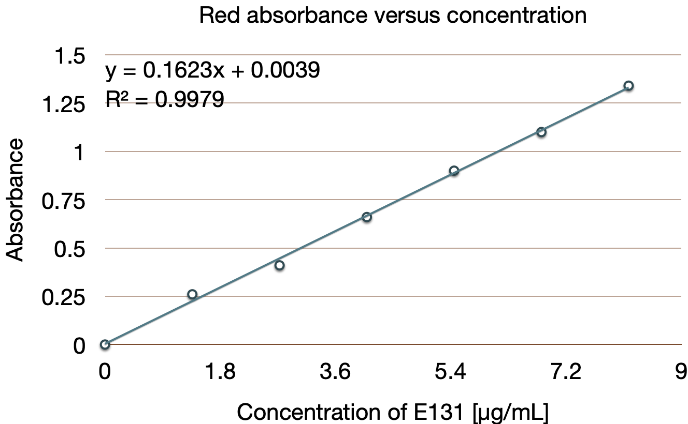
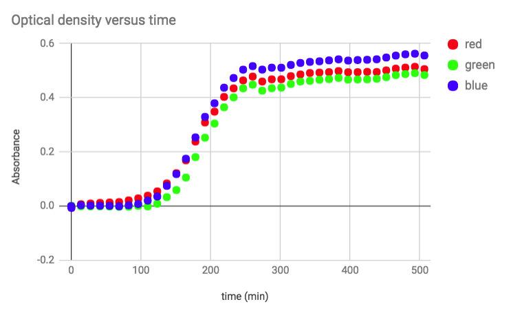

# Goal of the project

This project was done at the [Hackuarium](http://www.hackuarium.ch/en/) association, a DIY biology hacking-space and open laboratory located in Ecublens (Switzerland). Feel free to [contact us](https://form.jotformeu.com/71600609780354) if you would like additional information or would like to buy a fully built and tested spectrophotometer.

Recently, the open-source and open-hardware community has been involved in the creation of open scientific tools. In this context, a few spectrophotometer projects emerged. However, none of them was sufficiently evolved to be casually used in a laboratory. It is for this reason that we started this project.
Our goal was to create a simple spectrophotometer that measures the
absorbance of a sample for 3 different light colors (red, green, blue), that is
self-contained (battery powered) and displays the result on a LCD screen. In addition, the tool had to be reliable, precise and cheap.

The initial idea was that you could teach spectrophotometry without
having to buy an expensive instrument, since you can find experiments
that do not require a specific light wavelength. This includes
optical density for bacteria culture, determination of a pigment's concentration in
a solution, determination of the kinetic of a reaction and many others.

The device is rather cheap, for you can buy all the components on AliExpress
(but one) and either 3D print or laser cut the case (MDF or acrylic glass). When constructing 10, the price
per spectrophotometer is around $30. However if you want to have a final
product with an aluminium case and PCBs already assembled, the cost would rather be $90 each if you order 20 of them.

# Can we do science with this ?

Before trying to explain how it is done in detail we should first answer this first question: can we do science with this tool? When thinking about the design of the spectro, we found a light sensor that converts the light energy to frequency that is linear on a range of nearly 10^6. This means that the luminosity range that we can measure precisely is really large. The experiments we did show that we can obtain reliable and reproducible results.

## Patent blue V

When checking the Beer-Lambert law with the food pigment Patent blue V (E131) we obtain the following results:

The result is rather good knowing that the solutions were simply prepared by adding various volumes (0 to 2 mL) of a concentrated pigmented solution with a 1mL seringe to 100mL of water which is not the most accurate method.

## Escherichia coli

Another feature of the simple-spectrophotometer is that it works on a rechargeable battery (autonomy of 48 hours). Consequently, you can measure a kinetic by placing the device directly inside an incubator, which is not feasible with a regular commercial spectrophotometer.

Optical density (OD) at 600nm is often used in biology to determine the biomass increase versus time. In this experiment we have placed Escherichia coli with cell growing media directly in the spectrophotometer cuvette and placed the spectrophotometer itself on a shaker in the incubator. We can then program it to measure the absorbance every X seconds. In our case we measured the absorbance every 30 minutes (up to 40 measures). The following curve was obtained.

# Cloning the project

All the code since the first day is open-source and you may get the code on `https://github.com/hackuarium/simple-spectro`.

This project uses SUBMODULES.

In order to clone it use:

`git clone --recurse-submodules https://github.com/hackuarium/simple-spectro`

To update the submodules:

`git submodule update --recursive --remote`
