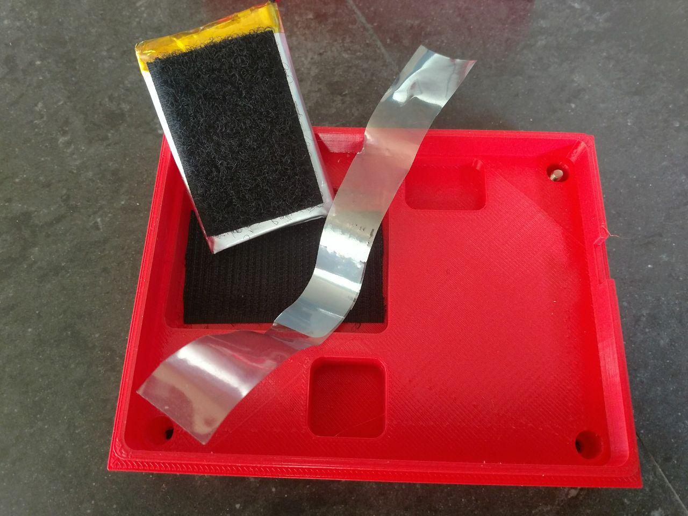
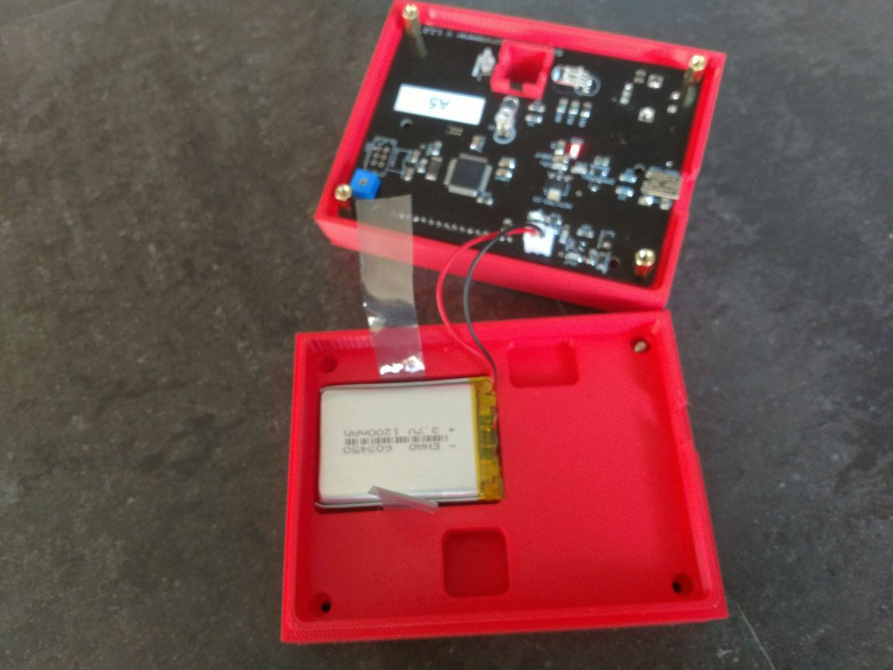
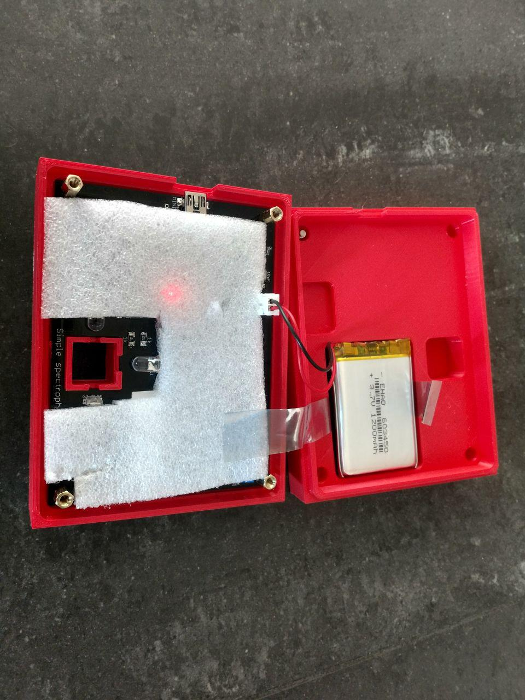
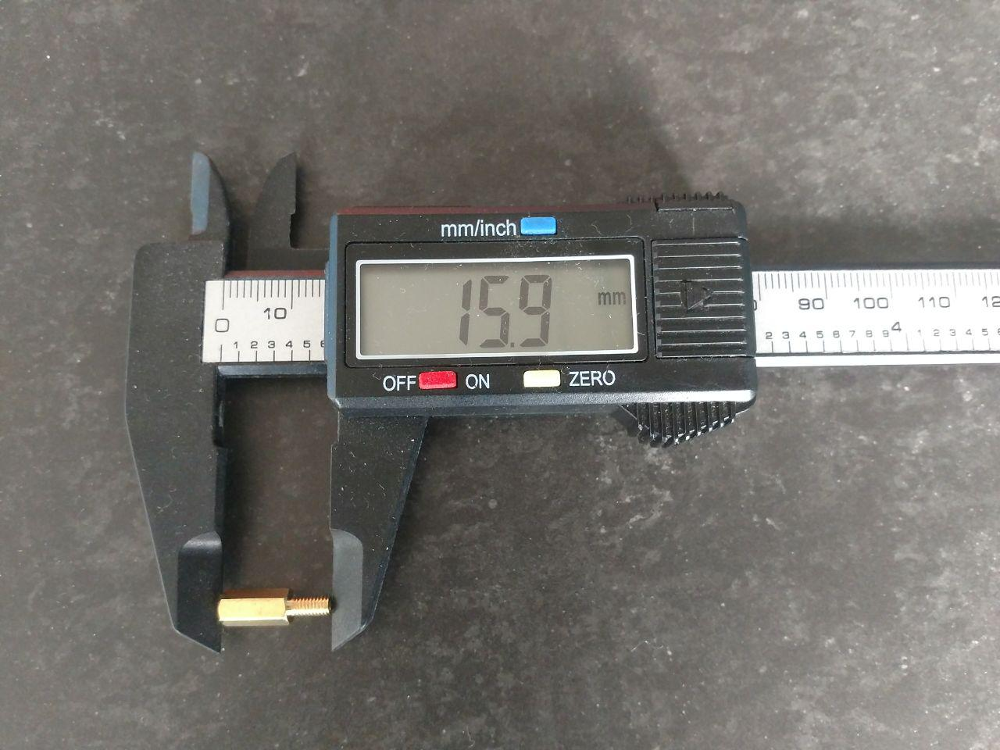
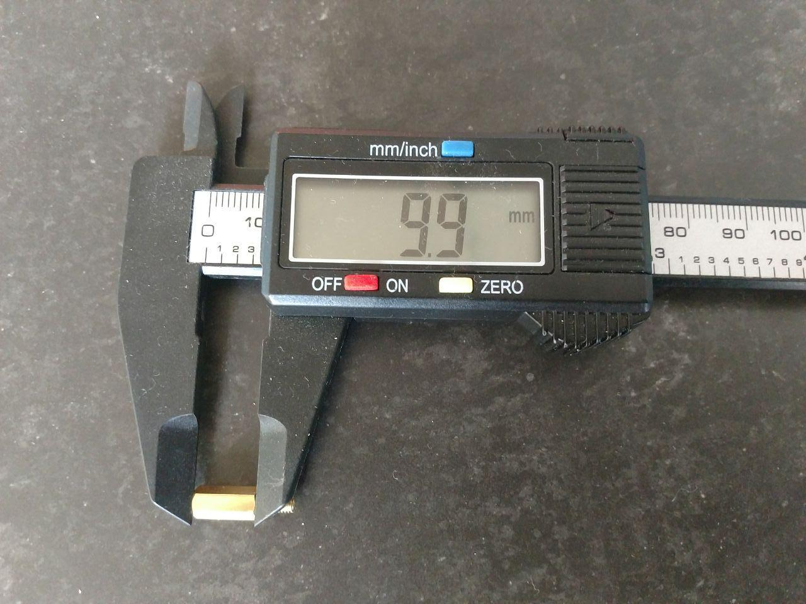
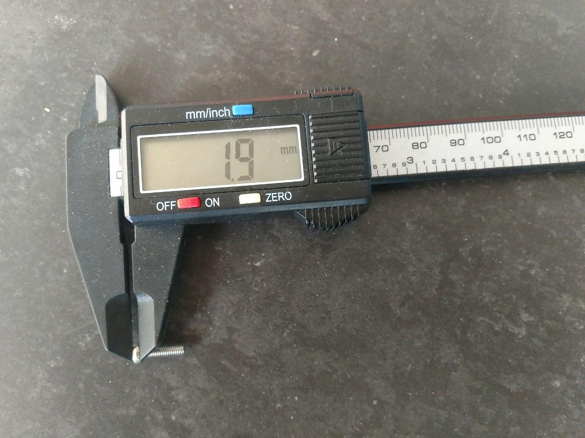

# The case

The case is done using FreeCAD and OpenSCAD. These applications looks rather complex at a first glance but have the huge advantage that all the parameters may be set in an internal spreadsheet. This allows to design parametric boxes that can be easily changed and updated.

Currently we have 3 versions of the box:

- The open-box can be easily opened to understand the way it works.
- A box that is designed to be cut using a laser cutter in 3mm MDF or acrylic glass.
- The closed-box is designed to be screwed and possibly done by aluminium milling (it can also be 3D-printed).

## Assembling the closed box

In order to prevent the battery to move inside the case, it is fixed with Velcro®, which makes it easy to remove and put back in place.

The PCB is fixed using nylon standoff spacers (16mm - 10mm M3). Nylon has the advantages of being light, non-conductive and soft. Therefore, the spacer will be damaged before the PCB.

A piece of 3mm thick foam is placed between the potentiometer and the battery to prevent damage. ThisIndeed, problems were encountered beforehand under heavy shaking in an incubator.

Finally the bottom is fixed to the top using four M3 x 12 mm nylon screws.

## Details of the screws

### Standoff spacer

### Screw

