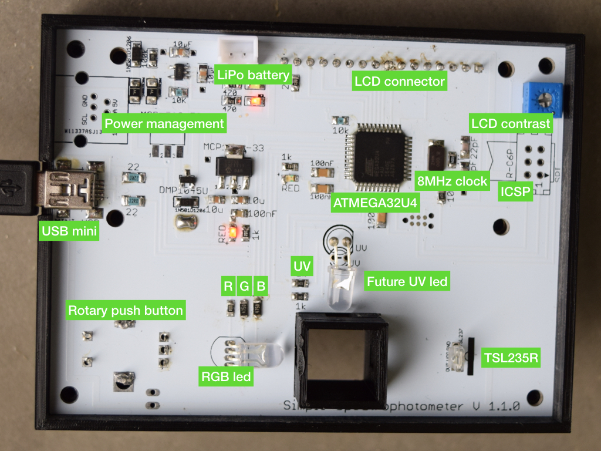

# The PCB

The electronic design is compatible with the Arduino platform. We use an
ATMEGA32U4 microcontroller which is directly connected to the peripherals we need for this spectrophotometer.

We prefer to design the full PCB rather than to make a shield for an existing Arduino board. Indeed, the extra work to add the microcontroller is rather limited, so it does not make sense from our point of view to create a shield. Also, the resulting board is smaller and more reliable.

The PCB is designed on [Eagle](https://kicad-pcb.org/). While
this software is rather expensive for professional use, it is free for personal projects
that have a surface under 80 cm2, which is the case for this board. Recently, we started using an open-source alternative called [KiCAD](https://www.autodesk.com/products/eagle/overview), which we highly recommend.

Thn, the PCBs are produced by [pcbway](https://www.pcbway.com/) that gives excellent
quality work for $5 for 10 PCB (+ shipping). They are really competitive and
fast. In our case, 10 PCBs cost $30 with shipping and we receive them under one week.

All the components we use but one are mainstream and can be found on eBay or AliExpress. The only special component is the light to frequency converter [TSL235R](https://www.sparkfun.com/datasheets/Sensors/Imaging/TSL235R-LF.pdf)
that we buy on [Mouser website](http://www.mouser.com).

The board is rather straighforward. The resistors values for the LEDs may however have to be tuned depending on the LEDs you are using.
If the value is too weak, the detector may saturate and you will get a message 'OVER'. It will also blink just once instead of 10 times.

- [Soldering the PCD](10_solder/README.md)
- [Calibration of LEDs](20_calibration/README.md)
- [Power and battery](30_power/README.md)
- [Debug](40_voltages/README.md)
