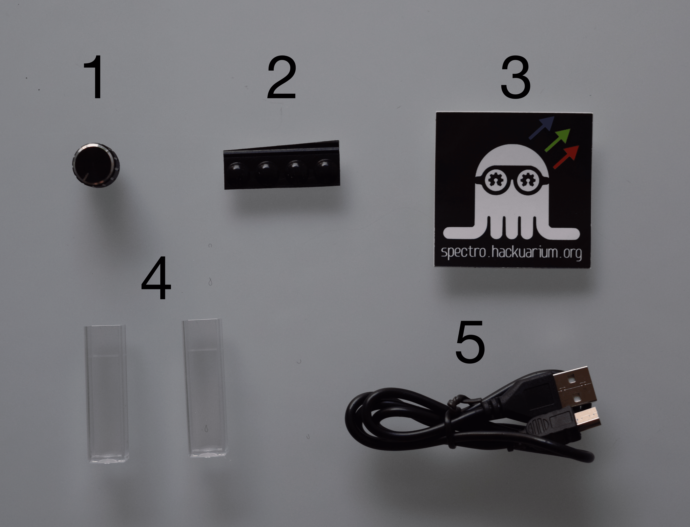

# Assembling the case

The case parts can be found in bag C, as well as all the screws that will be used to assemble it. We use nylon screws, because they are inexpensive, non-conductive, and can be cut easily to a desired length. Here is a list of the parts found in bag C:

1. 4 x 15mm M3 screws
2. 4 x male to female(MF) M3 spacers of 8mm height
3. 4 x 8mm M3 screws
4. 4 x female to female (FF) M3 spacers of 10mm height
5. A piece of Velcro®
6. Top of the case
7. Shorter sides of the case
8. The battery
9. Bottom of the case
10. Longer sides of the case
11. All four sides of the cell well

You'll also already need some of the parts of bag D, which contains:

1. Rotary push button cover
2. 4 x Rubber feet
3. Spectrophotometer sticker
4. 2 x cells for experiments
5. Mini USB cable for charging

## 1) Small screws and MF spacers on top

Screw the short M3 screws in the male to female spacers on the top face of the case. Be sure that you're doing it so that the PCB will fit afterwards (verify the orientation of the top).

## 2) Fix PCB on top face using FF spacers

Place the PCB on the male part of the MF spacers so that the screen and the button are well aligned with the corresponding holes. Fix the PCB in place using the FF spacers.

## 3) Assemble cell well

The order of the cell well is important! You should laid them out flat like on the first picture and then assemble them in volume.

## 4) Put cell well in place

Manipulate the well delicately so that it doesn't disassemble and place it in the corresponding hole in the top face of the case. The holes of the well should be aligned with both LEDs and the light detector (the largest hole facing the UV LED).

## 5) Put all sides in place

You can now take the four sides of the case and put the on the top face. The hole on one of the shorter sides must face the USB connector.

## 6) Battery and Velcro

The case in nearly assembled, but before you put the bottom face in place, you have to connect the battery to the PCB. Also, put one of the Velcro parts on the battery and the other one on the case's bottom face, as shown on the picture.

## 7) Put bottom face in place

You can finally put the bottom face in place.
:::tip
Use the screwdriver to gently push the parts of the well so that they enter in the bottom face hole. This can be a tricky. Just be a bit patient.
:::

## 8) Close the case

Close the case using the longer M3 screws and the screwdriver.

## 9) Rubber feet and sticker

Place the four rubber feet on the bottom of the case to prevent slipping. To be sure to always find the userguide for the spectro, you can also put the sticker from bag D on the bottom face of the case.

## 10) Button

Finally, you can take the rotary push button cover and gently push in on the button.

## You're done!

You've completed the assembly of the case! You're spectrophotometer is now nearly ready to use.
