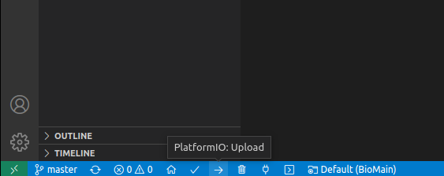
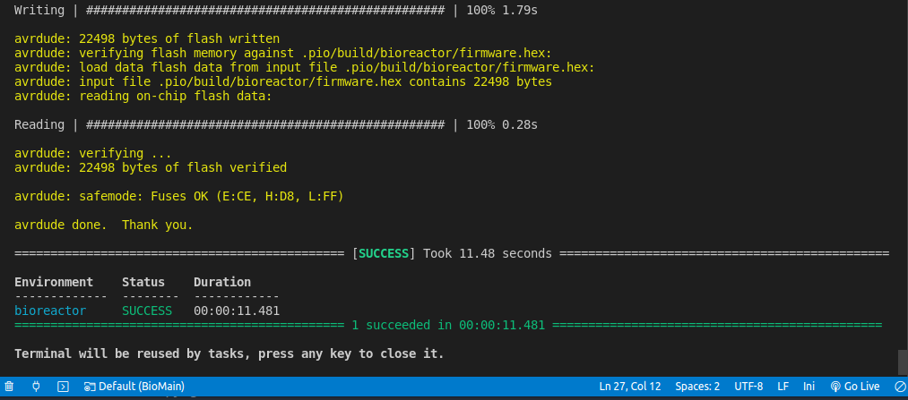

# Installation

## Cloning the project

### Requirements

1. Git (^2.25.1)
2. Visual Studio Code (^1.61.2)

You know with age we take some habits and it would be easier if you follow the same ones...

All our github projects are always in a folder called `git`
which is at the first level of the `home` directory. It is followed by the
name of the github user/organization and finally the project name.

So, to install the project from bash:

```bash
mkdir -p ~/git/hackuarium/
cd ~/git/hackuarium/
git clone https://github.com/Hackuarium/bioreactor-platformio.git
```

The possibility to clone the project will require that you validate your public key
in github!

## Installing the PlatformIO plugin

In VSCode you need to open `Extensions` tab or press (PC) <kbd>Ctrl</kbd>+<kbd>⇧</kbd>+<kbd>X</kbd>, (Mac) <kbd>⌘</kbd>+<kbd>⇧</kbd>+<kbd>X</kbd> and search ´PlatformIO IDE´ to install it:


## Hardware support for Leonardo 8MHz = LilyPad Arduino USB

The version `6.0.1` of the bioreactor is operating at 8MHz/3V3 instead of the standard 16MHz/5V.

:::warning
If you do any mistake and try flashing the bioreactor board as if it was a normal Leonardo, you will be able to flash the program but the USB port will not be recognized anymore afterwards. You will have to reflash the bootloader!!!
:::

## Using USBtiny

By default some Linux versions will only give you a USB readonly access and will prevent you from burning the bootloader. You can implent two options to solve this problem:

1. Check the ID for USBTinyISP:

```bash
$ lusb
```

- You need to find USBtiny in the prompt:

```bash
Bus 002 Device 001: ID 1d6b:0003 Linux Foundation 3.0 root hub 
Bus 001 Device 005: ID 8087:0a2b Intel Corp. 
Bus 001 Device 006: ID 047f:0115 Plantronics, Inc. Voyager Legend 
Bus 001 Device 003: ID 046d:c31c Logitech, Inc. Keyboard K120 
Bus 001 Device 002: ID 046d:c011 Logitech, Inc. Optical MouseMan 
Bus 001 Device 007: ID 1781:0c9f Multiple Vendors USBtiny 
Bus 001 Device 001: ID 1d6b:0002 Linux Foundation 2.0 root hub
```

- For this case, USBtiny is: **Bus 001 Device 007: ID 1781:0c9f Multiple Vendors USBtiny**.

- Show Device permissions:

```bash
$ ls -al /dev/bus/usb/001/007
```

- If you have a similar response like this:

```bash
crw-rw---- 1 root root 189, 6 Okt 2 09:45 /dev/bus/usb/001/007
```

- You need to change permissions:

```bash
$ ls -al /dev/bus/usb/001/007
```

2. In order for the USBTiny to have r/w access you should add a USB rule:

```bash
# UDEV rule for Arduino ISP R3 programmer board,
# to prevent having to run Arduino IDE as root to get it to program.
# Copy this file to /etc/udev/rules.d with the name 99-USBtiny.rules

SUBSYSTEMS=="usb", ATTRS{idVendor}=="1781", ATTRS{idProduct}=="0c9f", GROUP="plugdev", MODE="0666"
```

## That's it

You should now be able to compile the project from PlatformIO IDE.

### Burning bootloader

You can now proceed with burning the bootloader using the `program_via_USBtinyISP` environment created in `platformio.ini` file. Go to `platformIO Terminal` and type:

```bash
$: pio run -e program_via_USBtinyISP --target bootloader
```


### Upload the code

Once you have the bootloader, you can remove USBtinyISP and upload your code using USB cable directly between bioreactor and laptop with `PlatformIO: Upload` button or press <kbd>Ctrl</kbd> + <kbd>Alt</kbd> + <kbd>U</kbd>:



You can check upload success in the same terminal:



## The parameters

In order to control the bioreactor you should have a look at the description of the [Parameters](20_parameters.md) (Go Next).
