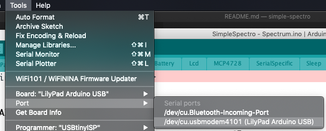
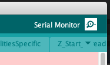
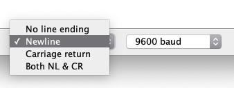

# Communication and settings

## Introduction

All our devices accept the Serial communication over USB as well as a common set of commands. The syntax of those commands are always the same:

- lowercases to access menu and commands
- uppercase to check or change parameters
- number + uppercase to change I2C connected devices

All the devices include the following commands: `h` for help, `s` for settings and `u` for utilities. Please note that the command has to be followed by either carriage return (CR), line feed (LF) or CR+LF.

For example with the `simple-spectro` and entering `h` you will obtain the following menu.

```
(h)elp
(i)2c
(s)ettings
(u)tilities
(d)ata
(k)inetic
(r)un experiment
(t)est
s(l)eep
```

### Parameters

All the devices share an array of parameters and those parameters may either be only readable or writable. All the parameters are numbers between -32768 and 32767 (internally they are stored as an array of int16). The parameters can be checked and changed using the corresponding uppercase letters that corresponds to the index in the array. For instance `A` for the index `0`, `B` for index `1` etc.

Depending the device you may have have only 4 parameters or more than 78 parameters. After using the 26 letters of the alphabet we are using 2 letter codes like AA, AB, ...

| Letter | Corresponding index |
| ------ | ------------------- |
| A      | 0                   |
| B      | 1                   |
| C      | 2                   |
| ...    | ...                 |
| AA     | 26                  |
| AB     | 27                  |
| ...    | ...                 |
| BA     | 52                  |
| ...    | ...                 |

Looking to `s`ettings for the simple-spectro you will get a list like:

```
0- A: 1441`
1- B: 21367
2- C: 14744
3- D: 49
4- E: 1
5- F: 20674
6- G: 23417
...
18- S: 4260
19- T: 2340
20- U: 1023
21- V: 15
...
```

And for example `T` is the current temperature multiplied by 100.

### List of parameters and their meaning

Each device is characterized by an id. The id can be checked `ui` or set `ui1234` from the serial interface.

The id is a number between -32768 and 32767 (16 bits). The first 8 bits indicates the kind of the device while the last 8 bits is a unique identifier if you have many device connected to the same computer.

Currently the following device have been defined:

| ASCII decimal | Letter | Kind          |
| ------------- | ------ | ------------- |
| 66 (0x42)     | B      | Beemos device |
| 67 (0x43)     | C      | Computer      |
| 36 (0x24)     | $      | OpenBio       |
| 54 (0x36)     | 6      | Bioreactor    |
| 83 (0x53)     | S      | OpenSpectro   |
| 84 (0x54)     | T      | SimpleSpectro |
| 35 (0x23)     | #      | Solar2015     |
| 80 (0x50)     | P      | PHMeter       |

All the information about the parameters are available at:

https://github.com/Hackuarium/legoino-device-information

In order to set the id of a device you need to multiply the device kind by 256 and add a unique ID from 0 to 255. It is advisable to have a code that can be represented as an ASCII text.

```
Dec Hex    Dec Hex    Dec Hex  Dec Hex  Dec Hex  Dec Hex   Dec Hex   Dec Hex
  0 00 NUL  16 10 DLE  32 20    48 30 0  64 40 @  80 50 P   96 60 `  112 70 p
  1 01 SOH  17 11 DC1  33 21 !  49 31 1  65 41 A  81 51 Q   97 61 a  113 71 q
  2 02 STX  18 12 DC2  34 22 "  50 32 2  66 42 B  82 52 R   98 62 b  114 72 r
  3 03 ETX  19 13 DC3  35 23 #  51 33 3  67 43 C  83 53 S   99 63 c  115 73 s
  4 04 EOT  20 14 DC4  36 24 $  52 34 4  68 44 D  84 54 T  100 64 d  116 74 t
  5 05 ENQ  21 15 NAK  37 25 %  53 35 5  69 45 E  85 55 U  101 65 e  117 75 u
  6 06 ACK  22 16 SYN  38 26 &  54 36 6  70 46 F  86 56 V  102 66 f  118 76 v
  7 07 BEL  23 17 ETB  39 27 '  55 37 7  71 47 G  87 57 W  103 67 g  119 77 w
  8 08 BS   24 18 CAN  40 28 (  56 38 8  72 48 H  88 58 X  104 68 h  120 78 x
  9 09 HT   25 19 EM   41 29 )  57 39 9  73 49 I  89 59 Y  105 69 i  121 79 y
 10 0A LF   26 1A SUB  42 2A *  58 3A :  74 4A J  90 5A Z  106 6A j  122 7A z
 11 0B VT   27 1B ESC  43 2B +  59 3B ;  75 4B K  91 5B [  107 6B k  123 7B {
 12 0C FF   28 1C FS   44 2C ,  60 3C <  76 4C L  92 5C \  108 6C l  124 7C |
 13 0D CR   29 1D GS   45 2D -  61 3D =  77 4D M  93 5D ]  109 6D m  125 7D }
 14 0E SO   30 1E RS   46 2E .  62 3E >  78 4E N  94 5E ^  110 6E n  126 7E ~
 15 0F SI   31 1F US   47 2F /  63 3F ?  79 4F O  95 5F _  111 6F o  127 7F DEL
```

### Checking a parameter

To check a specific parameter just enter the corresponding uppercase letter followed by enter.

### Changing a parameter

To change a parameter simple enter the uppercase letter followed by the new value. For example `AB123` will set the value of the parameter `AB` (parameter 27) to `123`.

### Changing muultiple parameters at once

An uppercase letter followed by comma separated value wills change consecutively the parameters. For example `B1,2,3` will set `B` to `1`, `C` to `2` and `D` to `3`.

:::important
Please take care than there is a limit in the string that can be sent. For simple devices using an 8-bit ATMEGA microcontroller it 32 bytes
:::

## Connecting to the device from the browser

Since March 2021 it is possible to communicate to external devices using Serial over USB using Google Chrome, Chromium or Edge browsers. All our devices accept this kind of connection and you may test this experimental feature in:

https://hackuarium.github.io/bioreactor-ui/preferences/local-devices

## Connecting to the device using the Arduino program

It is possible to control the device from the Serial over USB. You could use for example
the command `screen` in a bash if you're used to it, but the easiest is probably to use the "Serial Monitor" of the Arduino program.

Indeed the spectrophotometer appears as a "Lilipad Arduino USB" and you can just select it and access the data.

:::caution
When using the Arduino program, it is critical to choose the right board ("Lilipad Arduino USB") when programming it. Indeed the spectro contains an Atmega 32U4 at 8MHz. If it is programmed at a different frequency, the firmware will be corrupted and you will not be able to program the spectrophotometer again.
:::

### Accessing data from the Arduino program

1. Install the Arduino IDE software
2. Select 'Tools -> Board -> Lilypad Arduino USB'
3. Select 'Tools -> Port -> xxx Lilypad Arduino USB'
4. Click on Serial monitor icon (top right)
5. Select `linefeed` and `9600` in the bottom of the screen

### Select the right port



### Open the serial monitor



### Select Newline as line ending



## Controlling the device

You may now control the spectrophotometer from the keyboard. To see the available commands just enter `h` + Enter.

The instruction `s` will show you the current settings.

| Parameter | Number | Desciption                                                                                                                                                                              |
| --------- | ------ | --------------------------------------------------------------------------------------------------------------------------------------------------------------------------------------- |
| A         | 0      | Transmission sample color 1                                                                                                                                                             |
| B         | 1      | Transmission sample color 2                                                                                                                                                             |
| C         | 2      | Transmission sample color 3                                                                                                                                                             |
| D         | 3      | Transmission sample color 4                                                                                                                                                             |
| E         | 4      | Transmission sample color 5                                                                                                                                                             |
| F         | 5      | Transmission blank color 1                                                                                                                                                              |
| G         | 6      | Transmission blank color 2                                                                                                                                                              |
| H         | 7      | Transmission blank color 3                                                                                                                                                              |
| I         | 8      | Transmission blank color 4                                                                                                                                                              |
| J         | 9      | Transmission blank color 5                                                                                                                                                              |
| K         | 10     | Delay before acquisition of the blank                                                                                                                                                   |
| L         | 11     | Delay before the acquisition of the sample                                                                                                                                              |
| M         | 12     | Delay between each acquisition of a kinetic (after blank and first)                                                                                                                     |
| N         | 13     | Number of experiments for kinetic (max 240 / (number colors + 1))                                                                                                                       |
| O         | 14     | Number of the next experiment                                                                                                                                                           |
| P         | 15     | Current time waiting                                                                                                                                                                    |
| Q         | 16     | Number of acquisitions of 100ms that will be taken (default 10). This value could be reduced for fast kinetic                                                                           |
| R         | 17     | Invert the rotary button direction                                                                                                                                                      |
| S         | 18     | Battery voltage (hundredth of volt)                                                                                                                                                     |
| T         | 19     | Temperature (hundredth of degree)                                                                                                                                                       |
| V         | 21     | Active leds and other. A number between 0 and 63. Each bit represents a function (Red, Green, Blue, UV, Voltage, Temperature). 5 would correspond to Red and Blue (binary combination). |
| W         | 22     | Error                                                                                                                                                                                   |
| X         | 23     | Value of the channel that will be displayed in the result                                                                                                                               |
| Y         | 24     | Status                                                                                                                                                                                  |
| Z         | 25     | Current menu                                                                                                                                                                            |

You may change the parameters `K`, `L`, `M`, `N`, `Q`, `R`, `V` from the command line. To check a value just enter the corresponding uppercase letter (ie `N`) followed by `Enter`. To set a value, enter the new value just after the uppercase letter (ie `N20` to set 20 experiments for kinetic).

To retrieve all the data acquired in a kinetic, the easiest is use the `d` command. This will dump all the acquired data. Please beware that the data is stored in the RAM and it therefore lost when the device is not powered.

The dumped data will contain many columns. The first column corresponds to the time (in ms) since the device was turned on, the next columns correspond to all the acquired colors.
The first line corresponds to the blank and the next lines to the kinetic. The values for each column are directly proportional to the quantity of light that reaches the detector. If you want to calculate the corresponding absorbance you need to subtract to each value the corresponding value of the first row.

There is a utility that will allows to directly [convert and plot the results on-line](http://www.cheminfo.org/?viewURL=https%3A%2F%2Fcouch.cheminfo.org%2Fcheminfo-public%2F7b6eb01da45510275179c4b587bb63f0%2Fview.json&loadversion=true&fillsearch=Analyse+spectro+log) (using Google Chrome).

This device is also compatible with the project `Arduimon`, which can be used by programmers. The default qualifier is expected to be 21569. You may check the current qualifier of your device using the instruction `uq`. You may set the qualifier using `uq21569`.
